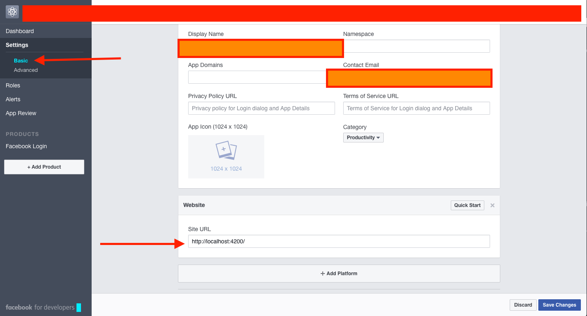
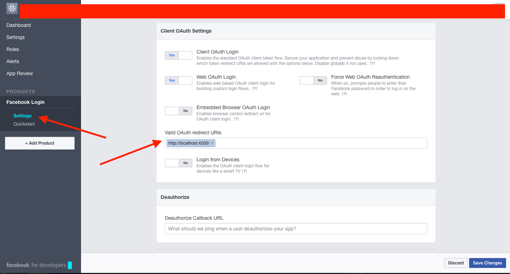

This example demonstrates how to use [passport-facebook-token](https://github.com/drudge/passport-facebook-token) with express and passport for JWT tokens.  In this example we will use the HTTP Header "Authorization" to send the facebook user token to this server.

The client to use exercise this app can be found here <TODO>.

The server runs on port http://localhost:3000 and the client on http://localhost:4200.  The server is a barebone express server and the client is an angular 2 project built with the angular-cli.

See the following configuration for the facebook app




TODO pic 2

## Instructions

To install this example on your computer, clone the repository and install
dependencies.

Preconditions:  Configure a facebook app and update server.js to provide your app information.

```javascript
passport.use(new FacebookTokenStrategy({
  clientID: '<TODO>',
  clientSecret: '<TODO>'
```
```bash
$ git clone <this repo>
$ cd express-passport-facebook-token-example
$ npm install
$ node server.js
```

Start the server.

```bash
$ node server.js
```

After starting the server, start the client.
